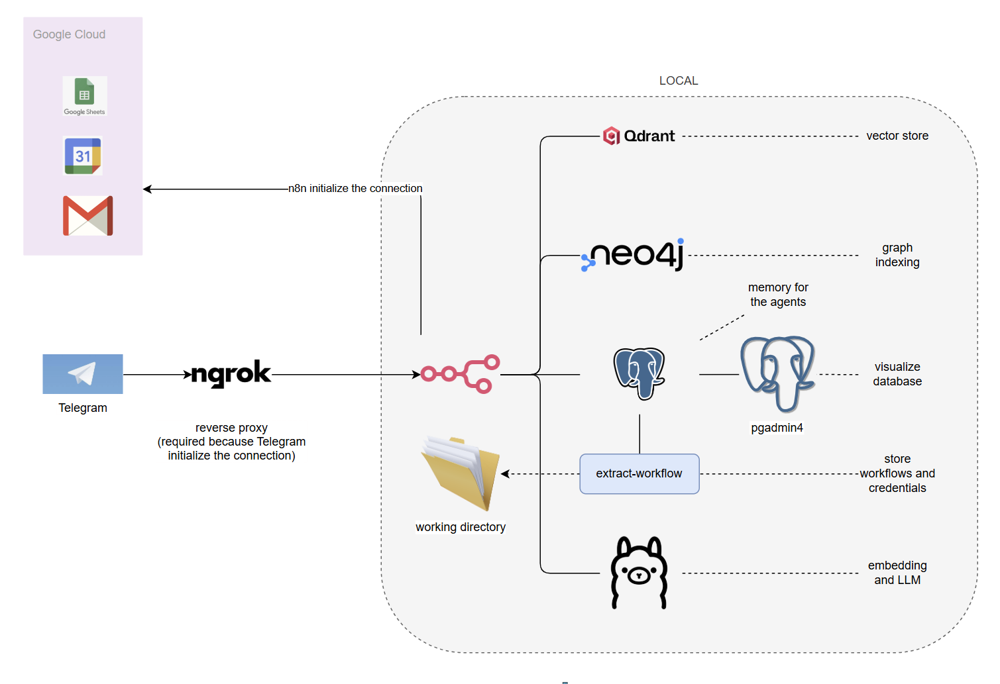
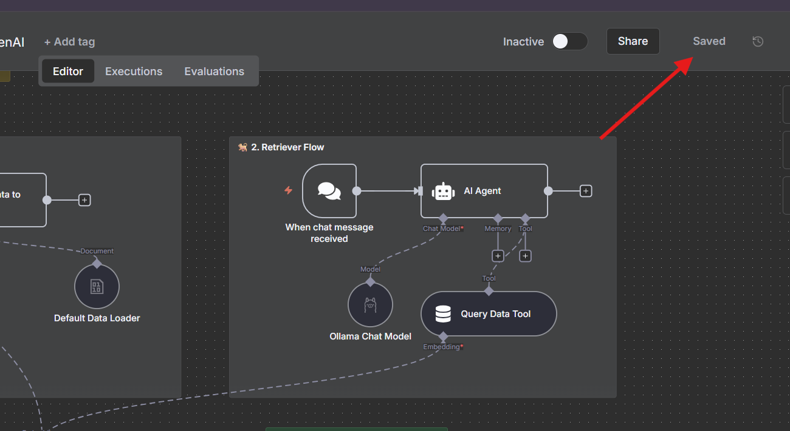
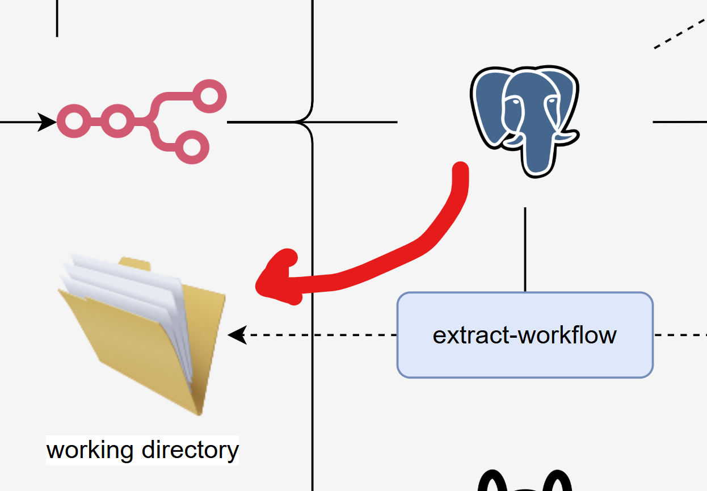

# - N8N - All in One

This is a powered version of the `n8n-starter-kit` that includes:
- `Graphql`
- Reverse proxy with `nGrok`
- example workflows
- git version for workflows and credentials
- `pgadmin4` admin container
- sample credentials form `Telegram`, `Google Calendar`, `Google Gmail`, `Google Sheet`



## -- pre-requisites
- ngrok
- docker compose

## -- How to use it

- start the project with compose

```sh
docker compose --profile gpu-nvidia up --build
```

- create a reverse proxy using ngrok. This is necesasary when using Telegram because Telegram needs to know how to reach our local n8n service. [More info](https://ngrok.com/docs/guides/share-localhost/quickstart)

```sh
ngrok config add-authtoken $YOUR_NGROK_TOKEN
ngrok http 5678
```

- Go to `http://localhost:5678` and start working as usual. When you are done working, save your project.




- Just saving the workflow is ok, but it will only live on `n8n container` memory. To push the workflow and credentials to github, execute the following command. It will take the id of the workflow or the credential and use it as the name of the json file.


```sh
docker compose up extract-workflow --build
```



- Then you can use your git tool to have control over the changes you have made. Whe you are done, delete everything:

```sh
docker compose down -v
```


# - Keep in sync

## -- test original repo

- delete local main branch
- checkout to upstream/main
- test


## -- protect the env variables

encrypt
```sh
sops encrypt --age PUBLIC_KEY .env > enc.env
```

decrypt
```sh
SOPS_AGE_KEY_FILE=../key.txt sops decrypt enc.env > .env